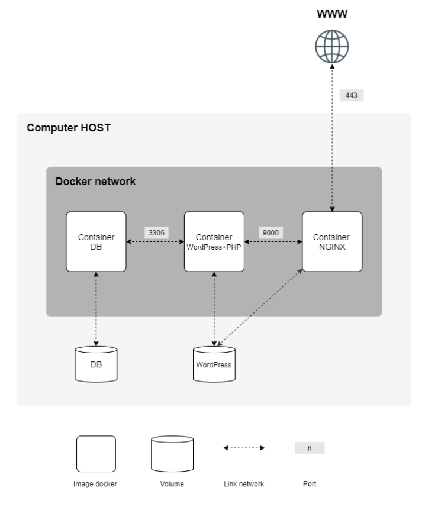

# Developer Documentation

## Overview

This document explains how to set up, build, run, and manage the Inception project from a developer perspective. It focuses on the internal structure, configuration, and data persistence.

---

## Environment Setup

### Prerequisites

Make sure the following tools are installed on your system:

- Docker
- Docker Compose
- Make

On 42 school machines, a virtual machine may be required to have proper permissions (sudo access).

Example setup VM:

I created a VM based on Debian Trixie image. And then:

```bash
apt update && upgrade -y
apt install -y vim curl php docker.io docker-compose make git netcat-openbsd
/usr/sbin/usermod -aG sudo csolari
/usr/sbin/usermod -aG docker csolari
mkdir -p /home/csolari/data
chown -R csolari:csolari /home/csolari/data
```

I configured my domain name so it points to my local IP adress. I added csolari in /etc/hosts

```text
127.0.0.1 csolari.42.fr
```

---

### Setup
Before launching the project, you must configure the environment variables.

Edit the `.env` file located in:

```text
srcs/.env
```

This file defines all sensitive data and configuration values:

```env
DOMAIN_NAME=student.42.fr
DB_NAME=Inception
DB_USER=your_user
DB_PASSWORD=your_password
DB_ROOT_PASSWORD=your_password
WP_TITLE=inception
WP_ADMIN_USER=admin
WP_ADMIN_EMAIL=admin@example.com
WP_ADMIN_PASSWORD=your_password
WP_USER_NAME=user
WP_USER_EMAIL=user@example.com
WP_USER_PASSWORD=your_password
```

⚠️ WP_ADMIN_USER musn't contains "admin" or "Administrator", in any form.
These variables are injected into containers at runtime.

### Project structure schema



---

## Build and Launch

### Using Makefile

The project provides a Makefile to simplify common operations.

```bash
make all       # build and start containers
make up        # Start containers
make down      # Stop containers
make logs	   # show logs
make clean     # Remove containers and images
make fclean    # Full cleanup (including volumes)
make re        # Rebuild everything
```

---

### Using Docker Compose (manual)

You can also run the project manually:

```bash
docker compose -f srcs/docker-compose.yml up --build -d
```

This command:
- Builds all images from Dockerfiles
- Creates containers
- Starts the services in detached mode

---

## Managing Images, Containers, Volumes and Networks

### Container Management

List running containers:

```bash
docker ps
```

List all containers:

```bash
docker ps -a
```

Stop containers:

```bash
make down
```

or

```bash
docker compose -f srcs/docker-compose.yml down
```

Restart containers:

```bash
make up
```

or 

```bash
docker compose -f srcs/docker-compose.yml up -d
```

Rebuild containers:

```bash
docker compose -f srcs/docker-compose.yml up --build
```

Enter in containers:

```bash
docker exec -it <container_id> bash
```
---

### Image Management

List images:

```bash
docker image ls
```

Remove unused images:

```bash
docker rmi <image_id>
```

---

### Volume Management

List volumes:

```bash
docker volume ls
```

Inspect a volume:

```bash
docker volume inspect <volume_name>
```

Remove unused volumes:

```bash
docker volume rm <volume_name>
```

---

### Network Management

List networks:

```bash
docker network ls
```

Inspect a network:

```bash
docker network inspect <network_name>
```

Remove unused networks:

```bash
docker network rm <network_name>
```

---

### Logs and Debugging

View all logs:

```bash
make logs
```

or

```bash
docker compose -f srcs/docker-compose.yml logs
```

View logs for a specific service:

```bash
docker compose -f srcs/docker-compose.yml logs nginx
docker compose -f srcs/docker-compose.yml logs wordpress
docker compose -f srcs/docker-compose.yml logs mariadb
```

---

## Data Persistence

### Where Data is Stored

The project uses Docker volumes to persist data outside of containers.

Typical persisted data includes:

- **MariaDB data**: database files
- **WordPress data**: website files (uploads, themes, plugins)

Volumes are defined in `docker-compose.yml` and are automatically created by Docker.

---

### How Persistence Works

Unlike containers, which are ephemeral, volumes remain even if containers are stopped or removed. This ensures that:

- Database content is not lost
- Website files remain intact
- The project can be restarted without data loss

---

### Important Notes

- Removing containers does **not** delete volumes

```bash
make clean
```

- To fully reset the project (including data), use:

```bash
make fclean
```

or manually:

```bash
docker compose -f srcs/docker-compose.yml down -v
```

---

## Notes for Developers

- All services are isolated but connected via a Docker network
- NGINX acts as a reverse proxy and handles HTTPS
- WordPress uses PHP-FPM and is initialized via a custom script
- MariaDB is initialized via a custom script also

Make sure to rebuild images after modifying Dockerfiles or configuration files.